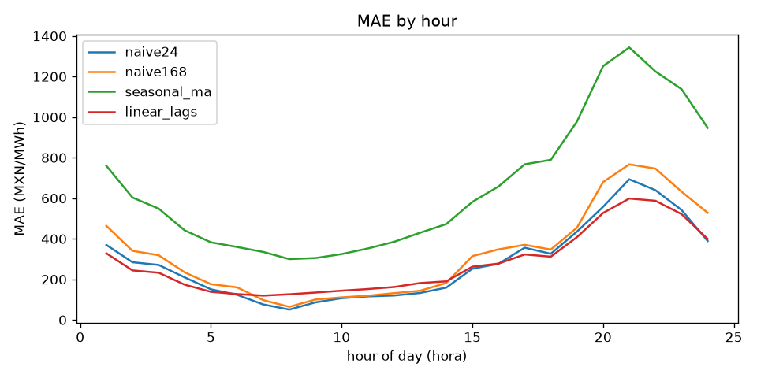
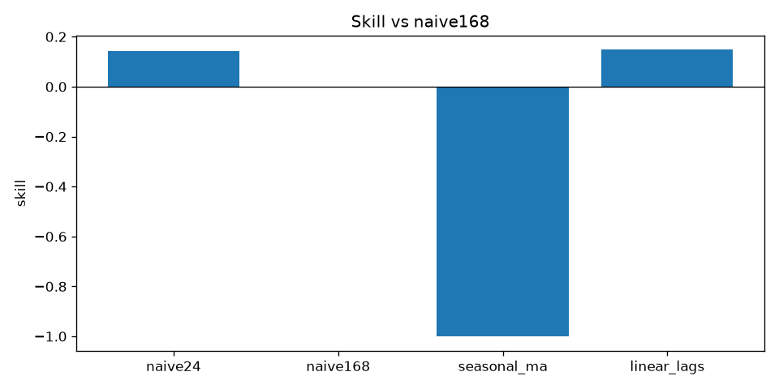
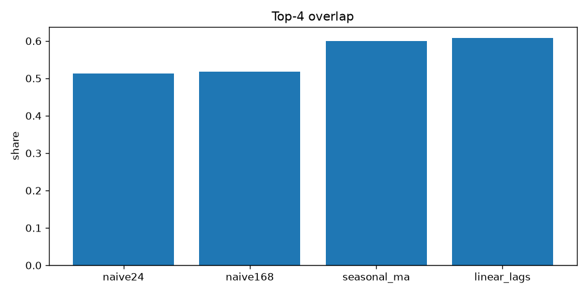
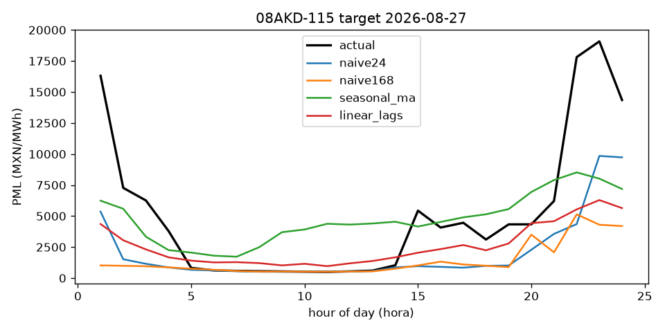

# Baselines - dataset final

18216 samples, 99 nodes, targets 2026-03-20 to 2026-09-19; 3650 spike days (max hour above mu + 4 sigma). Skill is relative to `naive168`.

## Metrics: all

| model       |     mae |     rmse |   smape |   skill |   top4_overlap |   captured_value |   n_samples |
|:------------|--------:|---------:|--------:|--------:|---------------:|-----------------:|------------:|
| naive24     | 280.441 |  756.308 |  28.640 |   0.141 |          0.512 |            0.865 |       18216 |
| naive168    | 326.513 |  875.539 |  32.709 |   0.000 |          0.517 |            0.871 |       18216 |
| seasonal_ma | 653.454 | 1045.015 |  64.214 |  -1.001 |          0.600 |            0.914 |       18216 |
| linear_lags | 278.169 |  659.459 |  31.829 |   0.148 |          0.608 |            0.917 |       18216 |

## Metrics: no spike

| model       |     mae |    rmse |   smape |   skill |   top4_overlap |   captured_value |   n_samples |
|:------------|--------:|--------:|--------:|--------:|---------------:|-----------------:|------------:|
| naive24     | 253.599 | 699.667 |  27.705 |   0.118 |          0.491 |            0.872 |       14566 |
| naive168    | 287.646 | 805.550 |  31.008 |   0.000 |          0.514 |            0.883 |       14566 |
| seasonal_ma | 637.572 | 995.371 |  65.247 |  -1.217 |          0.573 |            0.912 |       14566 |
| linear_lags | 245.820 | 569.227 |  31.620 |   0.145 |          0.583 |            0.917 |       14566 |

## Metrics: spike

| model       |     mae |     rmse |   smape |   skill |   top4_overlap |   captured_value |   n_samples |
|:------------|--------:|---------:|--------:|--------:|---------------:|-----------------:|------------:|
| naive24     | 387.560 |  949.263 |  32.372 |   0.195 |          0.598 |            0.839 |        3650 |
| naive168    | 481.617 | 1111.801 |  39.497 |   0.000 |          0.530 |            0.825 |        3650 |
| seasonal_ma | 716.834 | 1223.226 |  60.094 |  -0.488 |          0.710 |            0.919 |        3650 |
| linear_lags | 407.264 |  936.653 |  32.663 |   0.154 |          0.707 |            0.916 |        3650 |

## MAE and skill by region

| region     |   mae_naive24 |   skill_naive24 |   n_samples |   mae_naive168 |   skill_naive168 |   mae_seasonal_ma |   skill_seasonal_ma |   mae_linear_lags |   skill_linear_lags |
|:-----------|--------------:|----------------:|------------:|---------------:|-----------------:|------------------:|--------------------:|------------------:|--------------------:|
| CENTRAL    |       242.688 |           0.084 |        1840 |        264.978 |            0.000 |           630.897 |              -1.381 |           224.899 |               0.151 |
| NORESTE    |       203.221 |           0.075 |        4968 |        219.693 |            0.000 |           533.497 |              -1.428 |           188.635 |               0.141 |
| NOROESTE   |       198.147 |           0.127 |        1840 |        226.995 |            0.000 |           375.843 |              -0.656 |           200.616 |               0.116 |
| NORTE      |       207.670 |           0.095 |        1288 |        229.548 |            0.000 |           469.777 |              -1.047 |           196.346 |               0.145 |
| OCCIDENTAL |       214.002 |           0.073 |        3680 |        230.906 |            0.000 |           561.132 |              -1.430 |           196.756 |               0.148 |
| ORIENTAL   |       311.699 |           0.141 |        3312 |        363.071 |            0.000 |           812.176 |              -1.237 |           302.084 |               0.168 |
| PENINSULAR |       932.011 |           0.251 |        1288 |       1244.723 |            0.000 |          1584.266 |              -0.273 |          1063.332 |               0.146 |

## Figures

## lstm_history on dataset final (2026-09-20 16:16)

| model | MAE | RMSE | skill vs naive168 | top-4 overlap | captured value | MAE no-spike |
|---|---|---|---|---|---|---|
| lstm_history | 243.06 | 660.98 | 0.256 | 0.574 | 0.901 | 197.39 |

Naive-24h MAE 280.44, Naive-168h MAE 326.51 on the same samples.
